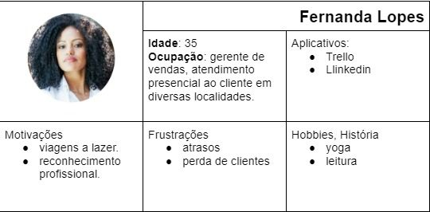
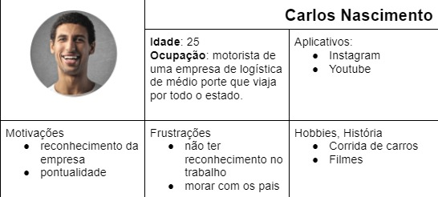
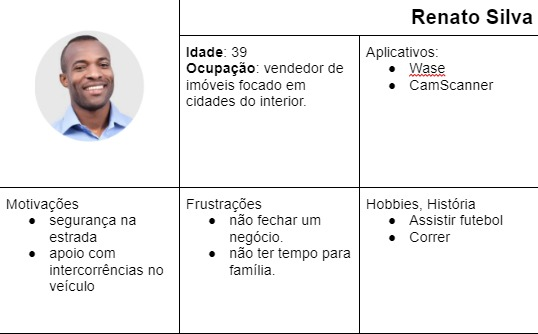
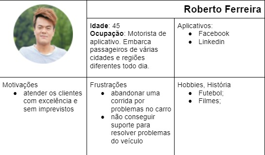
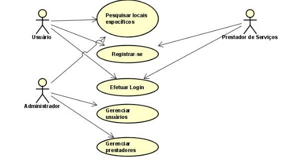

# Especificações do Projeto

Levando em consideração os fatores mencionados, torna-se necessário o desenvolvimento de uma aplicação que possa trazer comodidade e segurança para o condutor, construindo uma ferramenta que possa auxiliar na resolução de situações atípicas envolvendo o veículo e no cenário atual torna-se viável, pois além de ajudar o condutor, a aplicação estará contribuindo para o prestador angariar clientes e consequentemente ter um retorno financeiro. Atentando-se às necessidades dos condutores, o fator segurança também se destaca como uma das justificativas que corrobora com o intuito da aplicação.

## Personas

## Histórias de Usuários

Com base na análise das personas forma identificadas as seguintes histórias de usuários:

|EU COMO... `PERSONA`| QUERO/PRECISO ... `FUNCIONALIDADE`                 |PARA ... `MOTIVO/VALOR`                 |
|--------------------|----------------------------------------------------|----------------------------------------|
|Fernanda Lopes      | visitar vários clientes de forma efetiva e segura. | conseguir atender aos clientes sem atrasos ou com imprevistos minimizados.|
|Fernanda Lopes |conseguir resolver os imprevistos na estrada de forma rápida, prática e segura  |evitar impactos significativos no dia a dia que atrapalham sua jornada de trabalho. |
 Renato Silva | apresentar vários imóveis para clientes, normalmente entre cidades pequenas | evitar atrasos ou minimizá-los.|
 Renato Silva|conseguir direcionamento fácil de como chegar em postos de gasolina, borracheiro ou serviços mecânicos|situações atípicas que acontecem com o veículo impactam diretamente na qualidade do atendimento aos clientes.|
 |Carlos Nascimento| entregar as encomendas conforme cronograma|evitar impactos negativos como atrasos na entrega.|
 |Carlos Nascimento| ter uma retaguarda de apoio durante o trajeto estipulado| conseguir resolver questões relacionadas ao veículo de forma rápida e confiável.|
 |Roberto Ferreira| poder trabalhar independente do lugar onde irei com passageiro| caso aconteça algum problema com o carro, eu tenho soluções próximas a mim.|
 |Lisa Nakamoto| viajo/saio muito com minhas amigas e é normal não conhecermos totalmente o lugar onde vamos|quero ter a segurança de poder sair sem preocupações com minhas amigas, sabendo que se o carro apresentar algum problema terei uma solução rápida e confiável.|

## Requisitos

As tabelas que se seguem apresentam os requisitos funcionais e não funcionais que detalham o escopo do projeto.

- [Requisitos Funcionais

|ID    | Descrição do Requisito  | Prioridade |
|------|-----------------------------------------|----|
|RF-001| A aplicação deve apresentar os principais serviços que se encontram registrados de acordo com sua busca realizada na plataforma pelo próprio usuário.| ALTA| 
|RF-002| A aplicação deve apresentar para cada serviço descrição do próprio, imagens, avaliações, informações sobre o prestador.| ALTA |
|RF-003|A aplicação perfil de prestador e usuário poderão sofrer alterações desejadas por aquele que administra o perfil.| ALTA|
|RF-004|Deverá ser possível o usuário e prestador do serviço se cadastrarem e terem sua conta de login salvas.| MÉDIA|
|RF-005|O prestador pode cadastrar a quantidade ilimitada de serviços disponíveis.| MÉDIA|
|RF-006A aplicação permitirá o gerenciamento das contas de usuários| ALTA|

- [Requisitos Não Funcionais

|ID     | Descrição do Requisito  |Prioridade |
|-------|-------------------------|----|
|RNF-001| O sistema deve ser responsivo permitindo a visualização em um celular de forma adequada | ALTA | 
|RNF-002| O sistema deverá ser compatível tanto paara aparelhos androd quanto para ios| ALTA | 

## Restrições

O projeto está restrito pelos itens apresentados na tabela a seguir.

|ID| Restrição                                             |
|--|-------------------------------------------------------|
|01| O projeto deverá ser entregue no final do semestre letivo |
|02| O sistema deve se restringir às tecnologias solicitas para os requisitos do projeto |
|03| A equipe não pode  subcontratar o desenvolvimento do trabalho |

## Diagrama de Casos de Uso

|  |                                                       |
|--|-------------------------------------------------------|
|Registrar-se | Cadastro de usuários e prestadores de serviços que terão acesso ao sistema |
|Efetuar login| Autenticação de usuários e prestadores que terão acesso ao sistema  |
|Pesquisar locais específicos| Ferramenta de filtro de buscas que os usuários poderão utilizar para pesquisar locais em específicos|
|Gerenciar usuários| Controle do comportamento dos usuários no sistema|
|Gerenciar Prestadores| Controle do comportamento dos  prestadores de serviços no sistema |

## Tabela de atores e suas definições
|  |                                                       |
|--|-------------------------------------------------------|
|Usuário | Motorista que necessita de prestação de serviços automotivos   |
|Prestador de serviço| Profissional da área automotiva  |
|Administrador| Pessoa responsável por gerenciar o sistema, usuários e prestadores de serviço |

Diagrama

