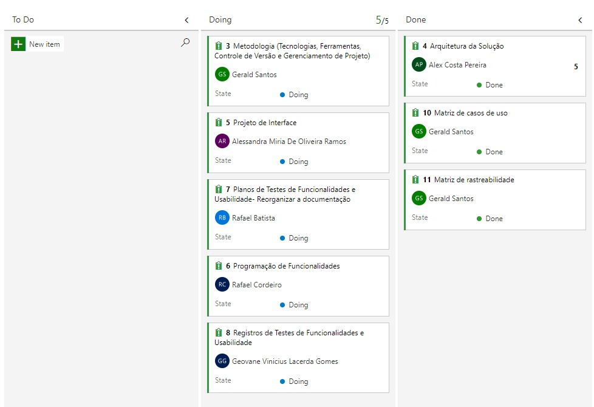

# Metodologia

O Azure DevOps é essencialmente direcionado para valorizar e enriquecer todas as fases do ciclo de vida dos aplicativos com soluções de ponta a ponta. Com essa finalidade, o Azure DevOps é usado para tornar os processos integralmente escalonáveis, repetíveis e controlados pelas equipes especializadas.

## Relação de Ambientes de Trabalho

Os artefatos do projeto são desenvolvidos a partir de diversas plataformas e a relação dos ambientes com seu respectivo propósito é apresentada na tabela que se segue. 

|Ambiente|Plataforma|Link de acesso|
|--------------------|-----------|----------------------------------------|
|Repositório de código fonte| GitHub|https://github.com/ICEI-PUC-Minas-PMV-ADS/pmv-ads-2021-2-e2-proj-int-t2-app-help|
|Projeto de Interface e Wireframes|Figma|https://www.figma.com/file/DOCxZmvBGWwBiDFcS1EELF/Untitled?node-id=0%3A1|
|Gerenciamento do Projeto|Azure DevOps|https://dev.azure.com/1329282/Puc-AppHelp|

## Controle de Versão

A ferramenta de controle de versão adotada no projeto foi o
[Git](https://git-scm.com/), sendo que o [Github](https://github.com)
foi utilizado para hospedagem do repositório.
 * Link e Repositório > https://github.com/ICEI-PUC-Minas-PMV-ADS/pmv-ads-2021-2-e2-proj-int-t2-app-help

O projeto segue a seguinte convenção para o nome de branches:

- `main`: versão estável já testada do software
- `unstable`: versão já testada do software, porém instável
- `testing`: versão em testes do software
- `dev`: versão de desenvolvimento do software

 

## Gerenciamento de Projeto

### Divisão de Papéis

Exemplificação: A equipe utiliza metodologias ágeis, tendo escolhido o Scrum como base para definição do processo de desenvolvimento. A equipe está organizada da seguinte maneira:
- Scrum Master: Alessandra Miria, Gerald Gabriel;
- Equipe de Desenvolvimento: Alex Costa, Rafael Silva, Rafael Augusto,Gerald Gabriel, Geovanne Vinícius;
- Equipe de Design: Alessandra Miria.
- 
### Processo

O processo escolhio para utilizaçao será basic. Escolha Básico quando sua equipe quiser o modelo mais simples que usa Problemas, Tarefas e Epics para acompanhar o trabalho. 
 

### Ferramentas

As ferramentas empregadas no projeto são:

- Editor de código VScode.
- Ferramentas de comunicação como Discord e Google Meet.
- Ferramentas de desenho de tela será o Figma(_wireframing_).

O editor de código foi escolhido porque ele possui uma integração com o sistema de versão. As ferramentas de comunicação utilizadas possuem integração semelhante e por isso foram selecionadas. Por fim, para criar diagramas utilizamos essa ferramenta por melhor captar as necessidades da nossa solução.

> **Possíveis Ferramentas que auxiliarão no gerenciamento**: 
> - [Azure](https://azure.microsoft.com/)
> - [Github](https://github.com/)
