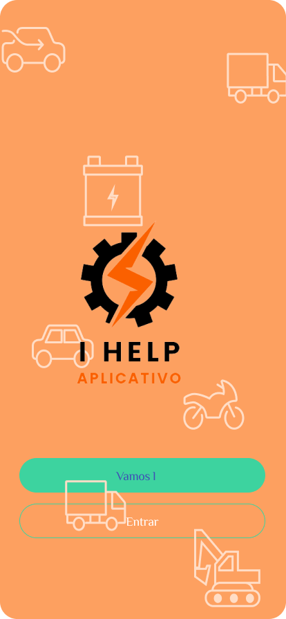
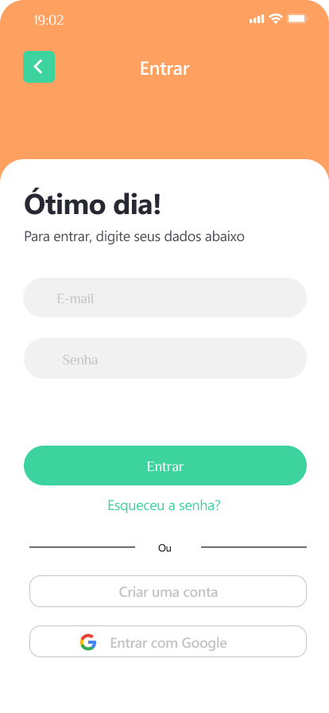

# Registro de Testes de Usabilidade

## Teste 1
Objetivo: Verificar se o usuário consegue se cadastrar  no sistema

Usuário: Ricardo Braga, 26 anos, motorista de aplicativo de transporte de usuário.

Tarefa: Acessar a página inicial e clicar no botão Entrar, em seguida Cadastre-se e escolha a opção Usuário. Preencher as informações como Nome, CPF, Data de Nascimento, E-mail, Senha, Chassi, Endereço, Bairro, Cidade, Estado (informações que são obrigatórias para o cadastro) e clicar em Salvar.

# Teste 2
Objetivo: Verificar se o usuário consegue cadastrar dados desejados pelo sistema após ter entrado para solicitar seu perfil.
Usuário: Patrícia Ferreira, 32 anos, representante de vendas.

Tarefa: Acessar a página inicial e clicar no botão entrar; Preencher as informações de login e senha, logo após, clicar no botão “entrar”

Observações: o usuário conseguiu seguir os passos sem empecilhos e conseguiu executar a tarefa com êxito.
